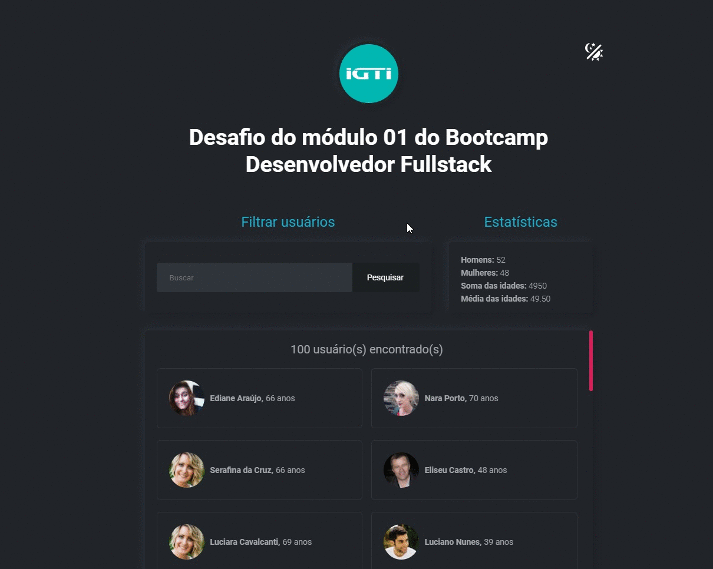

<h1 align="center">
  <p align="center">
    Bootcamp: Desenvolvimento Full Stack
  </p>
</h1>

<p align="center">
  Aplicação para filtrar usuários e mostrar estatísticas a partir do filtro definido.
</p>

<p align="center">
  <a href="https://www.w3.org/">
    
  </a>
  <a href="https://www.w3.org/">
    
  </a>
  <a href="https://www.ecma-international.org/">
    
  </a>
</p>

<div align="center">
  
</div>

## 📄 Indice

- [Sobre](#-sobre)
- [Tecnologias](#-tecnologias)
- [Como utilizar](#-como-utilizar)

## 📃 Sobre

Este projeto é um Desafio do Módulo 1 - Fundamentos, do __Bootcamp de Desenvolvimento Full Stack do IGTI__. Foi desenvolvida uma aplicação para filtrar usuários e mostrar estatísticas a partir do filtro definido.

---

## 💻 Tecnologias

Durante este primeiro módulo vimos os fundamentos das tecnologias base da web (HTML, CSS e JAVASCRIPT).

---

## 👨‍💻 Como utilizar

Primeiramente faça o clone do projeto em um diretório de preferência.

```bash
  # Clonar o repositório
  $ git clone https://github.com/denilsoncamara/igti-desafio-modulo-1.git
```
### Projeto backend

Na pasta backend foi criado um simples "simulador" de servidor usando a lib __json-server__ para acessarmos a api pelo frontend. Evitando assim muitos acessos e bloqueios por parte de uma API pública.

```bash
  # Entrar no diretório do projeto backend
  $ cd backend

  # Instalar as dependências
  $ yarn install

  # Iniciar o projeto
  $ yarn server
```

### Projeto web

```bash
  # Entrar no diretório do projeto web
  $ cd frontend

  # Iniciar o projeto
  $ Usar preferencialmente o plugin Live Server do VSCode
```

---

🐱‍💻 Desenvolvido por _[Denilson Câmara](https://www.linkedin.com/in/denilsoncamara/)_
